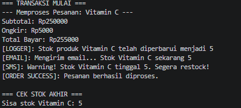

# Health Management E-Commerce System (Design Patterns Implementation)

Proyek ini adalah sistem manajemen inventaris dan pemesanan e-commerce produk kesehatan yang dibangun menggunakan **JavaScript (Node.js)** dengan fokus utama pada penerapan **Object-Oriented Programming (OOP)** dan **Design Patterns**.

## 🚀 Fitur Utama
- **Automated Object Creation:** Pembuatan produk berdasarkan kategori menggunakan Factory Pattern.
- **Centralized Inventory:** Manajemen stok tunggal yang konsisten di seluruh aplikasi menggunakan Singleton Pattern.
- **Real-time Notifications:** Sistem notifikasi otomatis (Log, Email, SMS) saat terjadi perubahan stok menggunakan Observer Pattern.
- **Dynamic Shipping Calculation:** Perhitungan ongkir otomatis berdasarkan kategori produk menggunakan konsep Inheritance.

## 🏗️ Design Patterns yang Digunakan

### 1. Factory Pattern
Digunakan di `ProductFactory.js` untuk menginisialisasi berbagai jenis produk (`Vitamin`, `Supplement`, `MedicalEquipment`) tanpa harus mengekspos logika pembuatan objek ke klien.

### 2. Observer Pattern
Digunakan untuk menangani dependensi antar objek. Objek `Product` bertindak sebagai *Subject*, sementara `Logger`, `EmailNotifier`, dan `SMSNotifier` bertindak sebagai *Observers* yang bereaksi otomatis saat stok produk berubah.

### 3. Singleton Pattern
Diterapkan pada `Inventory.js` untuk memastikan hanya ada satu instance inventaris yang mengelola seluruh data produk di dalam aplikasi, menjaga integritas data stok.



## 📂 Struktur Folder
```text
product-management-system/
├── models/            # Class dasar dan inheritance produk
├── services/          # Implementasi Factory, Singleton, dan Order Logic
├── observers/         # Implementasi Observer (Notifikasi)
├── utils/             # Helper functions
└── test.js            # Main entry point untuk pengujian sistem


